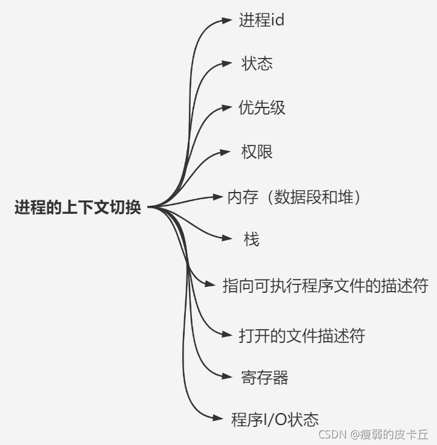
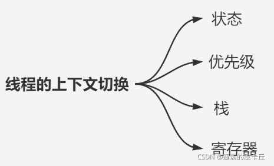
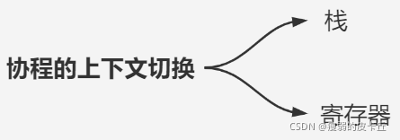
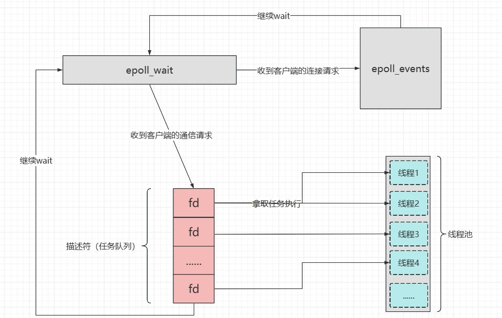
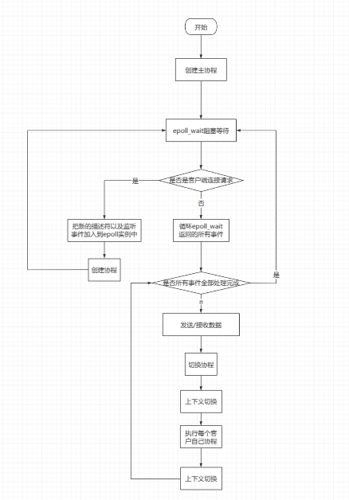
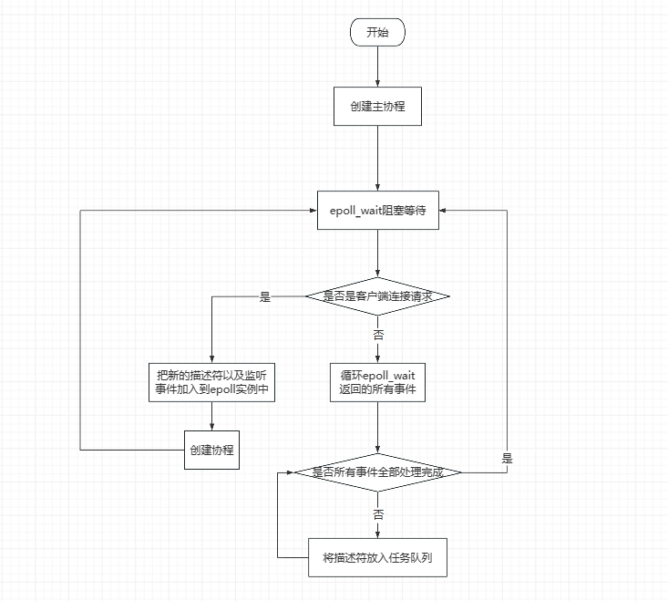
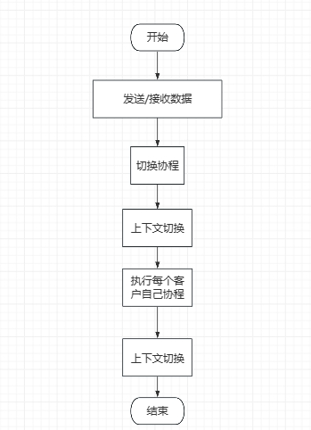

注：tcp通信，客户端发送数据，服务器接收数据，客户端使用write发送数据，多次调用write可能在底层封装成一个分节发送，也可能一个write一个分节发送，服务器调用read读取数据，只要调用read的时候来了的数据，只要数据没超过BUFSIZE都全部读上来
# 协程的起源
## 进程、线程、协程各自的上下文
### 进程切换（用户态--->内核态--->用户态）

### 线程切换（用户态--->内核态--->用户态）

### 协程切换（用户态）


线程上下文大概占8M，协程上下文大概占4K，协程消耗的资源远小于线程
同步与异步都是基于epoll实现的，不同之处在于，epoll监听到通信事件的时候，是一个一个处理，还是把任务下发给不同的线程处理
## 同步的问题（单线程）
同步实现起来简单，但短板也很明显，单线程操作耗时是最严重的，其次epoll监听事件每一轮处理，就会出现在处理每一轮结束后才会回到eoll_wait，如果处理过程中来了大量事件，就会全部拥堵在epoll_wait，如果描述符再采用的是阻塞模式，在每一轮处理过程中有些通信阻塞在IO的话，就会使每一轮的处理时间更加延长
## 异步的问题（多线程）
异步实现起来复杂，epoll把监听的事件分发给线程池中的某一个线程处理，epoll照样是是一轮一轮的处理，大概率会出现不同的轮次当中，那么就会出现多个线程管理同一个描述符的情况，如果读取管道的描述符采用的是阻塞模式，那么就会出现一个线程阻塞在read，另一个线程收到对端关闭的通知，此时第一个线程就会报一个操作已关闭或者不存在的描述符的错

# 协程运行流程

## 协程解决同步问题（单线程）
一个客户端对应一个协程，而不是一个客户端对应一个线程

## 协程解决异步问题（多线程）


# King式四元组
## commit
1、创建socket
2、编写协议encode protocol
3、发送数据send
4、交给epoll管理epoll_ctl()
## callback
1、epoll_wait监测
## create_context
### resume和yeild如何实现(原语操作)
1、setjmp/longjmp
2、ucontext
3、自己实现切换，汇编操作
### ucontext实现
```
/*
 * 协程类
 */
class Coroutine : public std::enable_shared_from_this<Coroutine> {
 public:
  typedef std::shared_ptr<Coroutine> sp;
  enum FiberState {
    HOLD,   // 暂停状态
    EXEC,   // 执行状态
    TERM,   // 结束状态
    READY,  // 可执行态
    EXCEPT  // 异常状态
  };
  Coroutine();
  Coroutine(std::function<void()> cb, uint64_t stackSize = 0);
  ~Coroutine();

  void Reset(std::function<void()> cb);
  static void SetThis(Coroutine *f);  // 设置当前正在执行的协程
  static Coroutine::sp GetThis();     // 获取当前正在执行的协程
  void Resume();                      // 唤醒协程
  static void
  Yeild2Hold();  // 将当前正在执行的协程让出执行权给主协程，并设置状态为HOLD

 private:
  static void
  Yeild2Ready();  // 将当前正在执行的协程让出执行权给主协程，并设置状态为READY
  static void FiberEntry();  // 协程入口函数
  void SwapIn();             // 切换到前台, 获取执行权限
  void SwapOut();            // 切换到后台, 让出执行权限

 private:
  ucontext_t mCtx;      // 存储每个协程对象自己的上下文信息
  FiberState mState;    // 当前协程的状态
  uint64_t mFiberId;    // 协程号
  uint64_t mStackSize;  // 每个协程都有自己的栈
  void *mStack;         // 协程自己的栈指针
  std::function<void()>
      mCb;  // 虽然可以定义每个协程不同的入口函数，
            // 但是为了统一，可以定义一样的入口函数，在内部调用不一样的实际函数
};
```
### 几个ucontext封装好的上下文切换的api
#### getcontext
```
#include <ucontext.h>

int getcontext(ucontext_t *ucp);
ucp：把当前线程的上下文信息填充到ucp结构体中

RETURN VALUE
       When successful, getcontext() returns 0 and setcontext() does not return.  On error, both return -1 and set errno appropriately.
```
#### makecontext
```
#include <ucontext.h>

void makecontext(ucontext_t *ucp, void (*func)(), int argc, ...);
ucp：指向 ucontext_t 结构体的指针，表示要创建的上下文。
func：一个无返回值且无参数的函数指针，表示新的上下文开始执行时要运行的函数。
argc：要传递给 func 函数的参数数量（最多 6 个）。
...：要传递给 func 函数的实际参数。
```
#### swapcontext
```
#include <ucontext.h>

int swapcontext(ucontext_t *oucp, const ucontext_t *ucp);
oucp：指向要保存当前上下文状态的 ucontext_t 结构体的指针。
ucp：指向要切换到的目标上下文的 ucontext_t 结构体的指针。
```
### epoll代码
```
Coroutine::GetThis();
Coroutine::sp acceptFiebr(new Coroutine(AcceptClient));
Coroutine::sp readFiber(new Coroutine(ReadFormClient));
while (1) {
    int ret = epoll_wait(epollfd, allEvent, EPOLL_EVENT_SIZE, -1);
    if (ret < 0) {
        if (errno == EINTR) {
        continue;
        }
        break;
    } else if (ret > 0) {
        for (int i = 0; i < ret; ++i) {
            int fdtmp = allEvent[i].data.fd;
            gClientFd = fdtmp;
            if (fdtmp == serverSock) {  // accept event
                acceptFiebr->Resume(); // 将主协程切换成accpet接收协程，执行任务，完成后，再次切换成主协程
                acceptFiebr->Reset(AcceptClient);//重新设置accept协程的信息
            } else if (allEvent[i].events | EPOLLIN) {  // read event
                readFiber->Resume();
                readFiber->Reset(ReadFormClient);
            }
        }
    }
}
```
## destory_context
就是销毁创建的协程对象以及分配的栈空间
